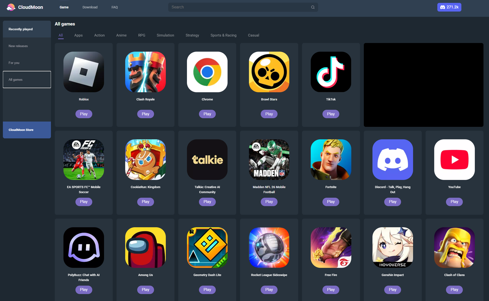

# CloudMoon InPlay

Cloudmoon InPlay is a simple JS site that proxies, hides, and loads Cloudmoon in a browser using Cloudflare workers, allowing you to effortlessly play Roblox, Fortnight, Call of Duty Mobile, Delta Force, and More in Browser at School or Work!

> [!NOTE]
> If you fork or use this repository, Please consider sharing or giving us a Star!

## Deployment Steps

To deploy your own Cloudmoon InPlay Cloudflare worker, click the deploy to Cloudflare button, and then play through the workers preview! 


[](https://deploy.workers.cloudflare.com/?url=https://github.com/sriail/Cloudmoon-InPlay)

Or use our official Site/ Deployment at: https://google-classroom.sriail.workers.dev/

> [!TIP]
> Be Shure to share it with your Friends / Co-workers. If you're worried about the url being blocked, Deploy a new worker or create a mirror using the code below on a html site host like Codesandbox of Github pages! Also has a bypass to chrome extension and AI autoblock software (blocks extensions at the root).

> [!NOTE]
> We are currently under maintenance, site upgrades are coming soon!


## Optional 2-Layer Proxy Steps

Optional second DOM Embed layer (Recommended if under heavy restrictions, to use on a different HTML site with your original worker URL)

> [!NOTE]
> Remember to add your worker URL if you want to add this extra layer around these lines
> ```html
> // WORKER URL HERE
>
>  <body>
>    <full-page-frame src="ADD WORKER URL"></full-page-frame>
>
>// WORKER URL HERE
>```

> [!TIP]
> You don’t just need to serve the lower html file. Just copy it into a blank html file, share it with you friends or co-workers, and when they double click it will pull up the proxy loading via the local file instead of an easy to block domain!

```html
<!DOCTYPE html>
<html lang="en">
  <head>
    <meta charset="UTF-8" />
    <title>Home - Classroom</title>
    <link
      rel="icon"
      type="image/png"
      href="https://ssl.gstatic.com/classroom/favicon.png"
    />

    <meta name="viewport" content="width=device-width, initial-scale=1.0" />

    <style>
      html,
      body {
        margin: 0;
        padding: 0;
        width: 100%;
        height: 100%;
        overflow: hidden;
        background: #000;
      }

      full-page-frame {
        display: block;
        width: 100%;
        height: 100%;
      }
    </style>
  </head>

// WORKER URL HERE (Currentley using the Default URL)

  <body>
    <full-page-frame src="https://google-classroom.sriail.workers.dev/"></full-page-frame>

// WORKER URL HERE

    <script>
      class FullPageFrame extends HTMLElement {
        connectedCallback() {
          // Layer 1
          const shadow1 = this.attachShadow({ mode: "closed" });

          const layer1Container = document.createElement("div");
          layer1Container.id = "layer1";

          const style1 = document.createElement("style");
          style1.textContent = `
            #layer1 {
              width: 100%;
              height: 100%;
              display: block;
            }
          `;

          shadow1.appendChild(style1);
          shadow1.appendChild(layer1Container);

          // Layer 2
          const shadow2 = layer1Container.attachShadow({ mode: "closed" });

          const layer2Container = document.createElement("div");
          layer2Container.id = "layer2";

          const style2 = document.createElement("style");
          style2.textContent = `
            #layer2 {
              width: 100%;
              height: 100%;
              display: block;
            }
          `;

          shadow2.appendChild(style2);
          shadow2.appendChild(layer2Container);

          // Layer 3
          const shadow3 = layer2Container.attachShadow({ mode: "closed" });

          const layer3Container = document.createElement("div");
          layer3Container.id = "layer3";

          const style3 = document.createElement("style");
          style3.textContent = `
            #layer3 {
              width: 100%;
              height: 100%;
              display: block;
            }

            iframe {
              width: 100%;
              height: 100%;
              border: none;
              display: block;
              background: #fff;
            }
          `;

          shadow3.appendChild(style3);
          shadow3.appendChild(layer3Container);

          // Create iframe
          const iframe = document.createElement("iframe");
          iframe.src = this.getAttribute("src");

          // Allow fullscreen
          iframe.setAttribute(
            "allow",
            "fullscreen; autoplay; clipboard-read; clipboard-write"
          );

          iframe.setAttribute("allowfullscreen", "");

          iframe.setAttribute(
            "sandbox",
            [
              "allow-scripts",
              "allow-same-origin",
              "allow-forms",
              "allow-popups",
              "allow-popups-to-escape-sandbox",
              "allow-modals",
              "allow-downloads",
              "allow-presentation",
              "allow-fullscreen"
            ].join(" ")
          );

          iframe.setAttribute("referrerpolicy", "no-referrer");

          layer3Container.appendChild(iframe);

          // Send title + favicon to iframe via postMessage
          iframe.addEventListener("load", () => {
            try {
              iframe.contentWindow.postMessage(
                {
                  type: "syncBranding",
                  title: document.title,
                  favicon:
                    "https://ssl.gstatic.com/classroom/favicon.png"
                },
                "*"
              );
            } catch (e) {
              console.warn("Brand sync failed:", e);
            }
          });

          // Obfuscation
          this.setAttribute("data-component", this.generateRandomId());
          layer1Container.setAttribute(
            "data-layer",
            this.generateRandomId()
          );
          layer2Container.setAttribute(
            "data-layer",
            this.generateRandomId()
          );
          layer3Container.setAttribute(
            "data-layer",
            this.generateRandomId()
          );
        }

        generateRandomId() {
          return Math.random().toString(36).substring(2, 15);
        }
      }

      customElements.define("full-page-frame", FullPageFrame);
    </script>
  </body>
</html>
```

## Usage Instructions

> [!IMPORTANT]
> Because of google's authentication policies, the google sign in button will NOT WORK. You must hit sign in with email and password instead. You will also need to register your cloudmoon account at home with google and set a password in settings before using elsewhere (Google Sign In button is now visibly hidden to avoid confusion).

Once you sign in, you can click and play games or apps in Cloudmoons library!
After that, you can use the Control bar for navigation, and go home using the home button, as well as fullscreening in-game (since many School / Work Pc's use low end components runing Windows 10 or Chrome OS, all ads are proxied and removed, striping any unecacary content)


> [!NOTE]
> When Cloudmoon tries to open a new Tab, it will open in the central iframe to avoid being blocked, keeping everything self contained in the site.

## Updates / Bug Fixes In Roadmap

- [x] Fix Proxy Reinizulaiztion
- [x] Add Fullscreen Fix
- [x] Add Adblocking
- [x] Remove Google Sign in Button
- [x] Renove Adboxes in Game
- [x] Add Fullscreen Typebox Fix
- [ ] Add Sidebar Hiding Fix
- [ ] Add PWA Functionality
- [ ] Add About:Blank Cloaking
